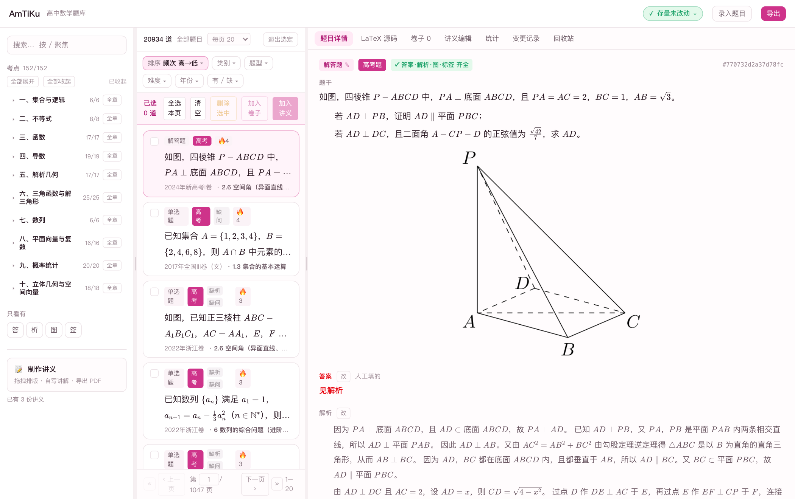
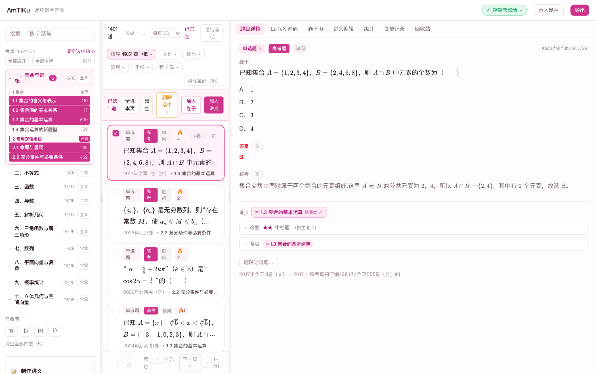
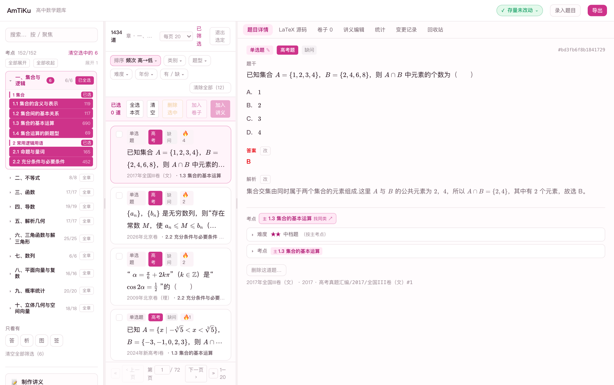
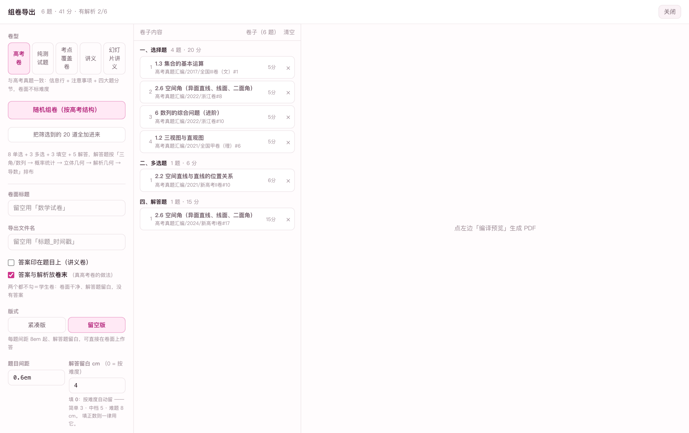

# AmTiKu · 高中数学题库与组卷系统

本地运行的高中数学题库：**检索 → 组卷 → 导出 → 讲义**，全部数据在本机，不上传任何服务器。
后端 Python（自研 HTTP 服务），前端 React + TypeScript，题目用 **LaTeX** 描述、界面用 **KaTeX** 渲染。

## 一、现在有什么

| | 数量 |
|---|---|
| 题目 | 20,934 道（高考真题汇编 13,244 · 模拟题 7,690） |
| 年代 | 1991–2026 |
| 答案 | **20,934 道（100%）** |
| 解析 | 20,923 道（99.9%） |
| 配图 | 2,706 道有图 |
| 考点 | 152 个考点（课标体系，见 `demo数据/知识点.json`） |

> 本仓库**只含代码**：上面这份题库**不公开**，仓库里只有 **4 道自编 demo 题 + 完整考点大纲**。

### 需要题库数据？

真实题库（含全部真题与模拟题、答案与解析）**不公开、也不随代码授权**。
如需购买或授权使用，**加 QQ：3138046922** 联系作者。

## 二、界面一览

| 题库列表（三栏工作台） | 题目详情 |
|---|---|
|  |  |

| 章节 / 考点树 | 组卷导出 |
|---|---|
|  |  |

* **左栏**按**章节 → 节 → 152 个考点**收题，点击即筛；还能按「缺答案 / 缺解析」找活
* **中栏**列表带题型、年份出处、难度星，以及答案 / 解析 / 配图 / 标签四项齐全度
* **右栏**详情：题干、选项、**红色答案**、解析、考点、出处、原始 LaTeX 源码
* **组卷**：高考卷（按真卷结构 8+3+3+5 排布）/ 纯测试卷 / 考点覆盖卷 / 讲义 / 幻灯片讲义，
  留空版可直接给学生作答；**讲义**支持画布自由排版

更多截图与逐页说明见 **[docs/功能介绍.md](docs/功能介绍.md)**，常见问题见 **[docs/常见问题.md](docs/常见问题.md)**。

## 三、快速开始

### 方式一：下载发布包（推荐）

到 [Releases](https://github.com/xiaoming-kun/AmTiKu/releases) 下载，解压后双击
`启动 AmTiKu.command`（macOS）或 `启动.bat`（Windows）——自动建环境、放 demo 数据、
起服务并打开浏览器（关掉页面服务自动退出）。需要机器上有 **Python 3.11+**。

### 方式二：从源码跑

```bash
python3 -m venv .venv && .venv/bin/pip install -r requirements.txt
cp -R demo数据/题目 ./题目 && cp -R demo数据/图片 ./图片 && cp demo数据/知识点.json ./知识点.json
python3 amti.py snapshot          # 建一次基线
./启动.sh 网页                     # 起服务 + 打开浏览器（http://127.0.0.1:8899）
```

## 四、题目长什么样

一道题 = 一个 `question` 环境 + 前面一行元数据（JSON 里只放 LaTeX 表达不了的字段）：

```latex
%% @q {"key": "高考真题汇编/2024/新高考I卷#1", "type": "single_choice", ...}
\begin{question}
已知 $A=\{x\mid -\sqrt[3]{5}<x<\sqrt[3]{5}\}$，$B=\{-3,-1,0,2,3\}$，则 $A\cap B=$\paren[A]
\begin{choices}
  \item $\{-1,0\}$
  \item $\{2,3\}$
  \item $\{-3,-1,0\}$
  \item $\{-1,0,2\}$
\end{choices}
\begin{solution}
因为 $1<\sqrt[3]{5}<2$，所以
\[
-\sqrt[3]{5}<-1<0<\sqrt[3]{5},
\]
而 $-3$、$2$、$3$ 都不在该区间内，故 $A\cap B=\{-1,0\}$。故选 A。
\end{solution}
\end{question}
```

* **答案写在作答位置**：选择 `\paren[A]`、填空 `\fillin[$-1$]`、解答写「见解析」
* **正文是字段的真相**：元数据行只补 LaTeX 表达不了的（key / 来源 / 考点）
* 题库按卷存放：`题目/001.tex`、`002.tex`…（每卷 ≤5000 题）
* **完整格式规范见 [docs/题目格式.md](docs/题目格式.md)**（题型、答案位置、元数据字段、渲染器硬性要求、怎么录入）

## 五、目录

```
amti.py            命令行入口（status / conform / accept / ingest / export …）
amti/              Python 核心：存储、规范化、录入、组卷、导出、Web 服务
web/               前端源码（React + Vite + Tailwind）；构建产物在 web/dist
slidev/            讲义导出用的 Slidev 工程
demo数据/          4 道自编题 + 完整考点大纲 + 1 张示意图
测试/              回归测试（接口、讲义、删题安全）
TeXLive安装.md      想导出 PDF 时看这个
```

## 六、导出 PDF 需要自己装 LaTeX

「导出试卷 / 讲义 PDF」需要一个 LaTeX 引擎（程序调用 `xelatex`）。
本仓库**不内置**（各平台二进制不同，且在别人机器上容易因字体/映射缺失而编译失败）。
按 **`TeXLive安装.md`** 装一次即可（macOS / Windows / Linux 三平台，含国内镜像与常见报错处理）。

**不装也不影响**浏览、搜索、编辑、组卷与预览。

## 七、开发

```bash
python3 amti.py accept          # 四层验收：单元自检 / 规范审查 / 端到端渲染 / 快照——必须全绿
python3 测试/接口测试.py         # 接口回归 14 项
python3 测试/讲义测试.py         # 讲义导出 18 项
cd web && npx tsc --noEmit && npm run build
```

编码约定与模块职责见 **`AGENTS.md`**；题目格式的完整定义见仓库内的规范文档。

## 八、许可与数据

* **代码**：MIT（见 `LICENSE`）
* **题库数据**（题目、答案、解析、配图）：属于作者，**保留所有权利**，不在本仓库中
* **考点大纲**（`demo数据/知识点.json`，152 个考点）：课标结构，属公开资料，随 MIT 一并提供
* **demo 题**：作者自编，非真题
