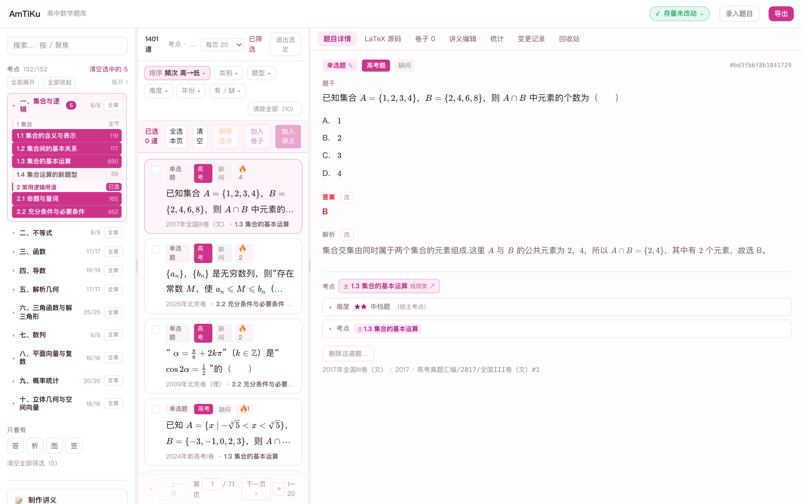

# 功能一览

> 截图全部来自本机真实运行（题库为作者私有数据，**不在本仓库中**；把题库放到
> `题目/`、`图片/`、`知识点.json` 即可复现同样的界面）。

## 1. 三栏工作台：按章节 / 考点收题

* **左栏**：章 → 节 → 考点的完整课标树（152 个考点），带每个考点的题量与覆盖情况，
  点击即筛。也可以按「只看有题 / 缺答案 / 缺解析」快速找活。
* **中栏**：题目列表，每张卡片给出题型、年份出处、难度星、以及**答案 / 解析 / 配图 / 标签**四项是否齐全。
  顶部支持全文检索、多条件筛选（类别 / 题型 / 难度 / 年份 / 有缺）、分页。
* **右栏**：选中题目的详情——题干、选项、**红色标注的答案**、解析、考点、出处、原始 LaTeX 源码。

## 2. 章节与考点树

考点树是**课标结构**（十章 → 若干节 → 152 个考点），每题都挂到具体考点上，
所以能一眼看出"哪一章已经铺满、哪一节还空着"，也支持按考点直接组卷。

## 3. 筛选

类别（高考真题 / 模拟题）、题型、难度、年份、有缺项——可叠加使用；
筛选条件会带进组卷，比如"2020 年之后的导数压轴题，只要没做过讲义的"。

## 4. 题目详情

题干、选项、答案、解析、考点、出处同屏；右侧可切换 **LaTeX 源码**（题目本身是 LaTeX，
所见即所存）。答案用红色标出，解析支持完整的 LaTeX 公式与插图。

## 5. 组卷导出

* **五种卷型**：高考卷 / 纯测试卷 / 考点覆盖卷 / 讲义 / 幻灯片讲义
* **高考卷**按真卷结构排布（8 单选 + 3 多选 + 3 填空 + 5 解答，解答题按三角 / 数列 /
  概率统计 / 立体几何 / 解析几何 / 导数分布），也可以「随机组卷」一键生成
* **版式**：紧凑版（省纸）/ 留空版（学生直接作答，可调题目间距与解答留白）
* **答案**：印在题目上、放卷末、或不印（学生卷）
* 导出为 PDF 需要本机装有 LaTeX，见 [TeXLive安装.md](../TeXLive安装.md)

## 6. 讲义与画布编辑

「制作讲义」可以把选题排成**一题一页的讲义**（A4），并用画布工具自由拖拽排版，
导出后用于 iPad 讲课或打印。讲义支持隐藏答案 / 显示答案两种模式。

## 7. 录入题目

界面里可直接**粘贴 LaTeX 录入**：解析器先验证格式（15 项规范检查）、查重、预检缺图，
全部通过才允许入库；入库时会自动规范化（不规范的题根本进不来）。

---

* 想自己试：见 README 的「快速开始」。
* 遇到问题：见 [常见问题](常见问题.md)。
