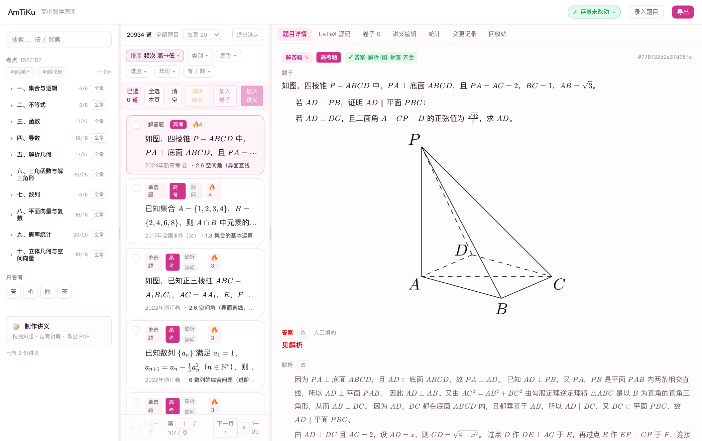
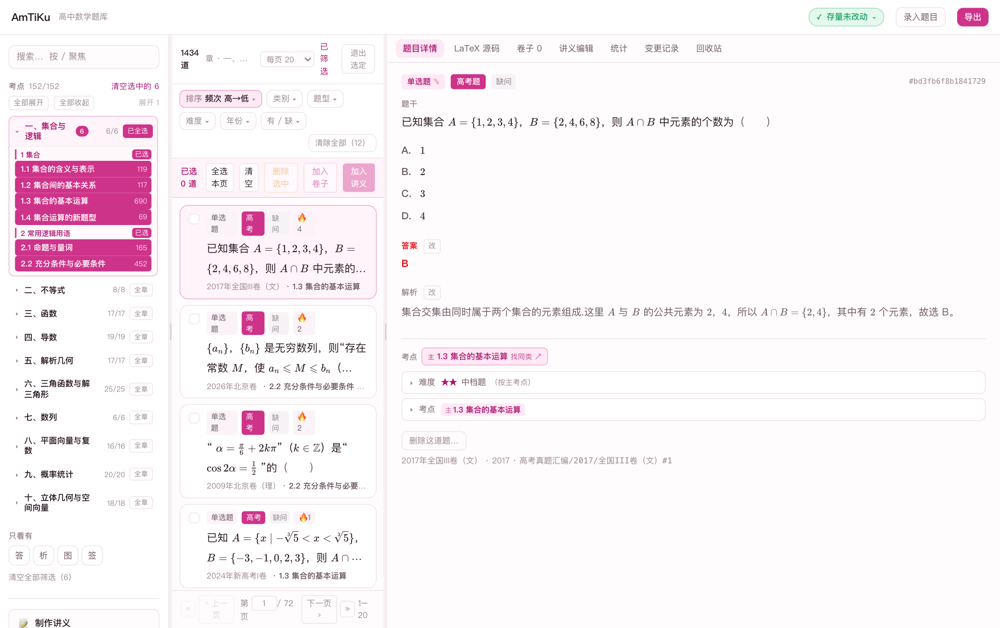
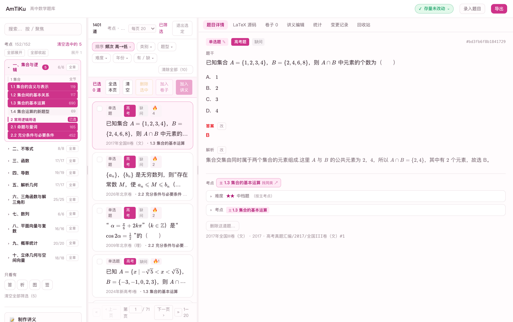
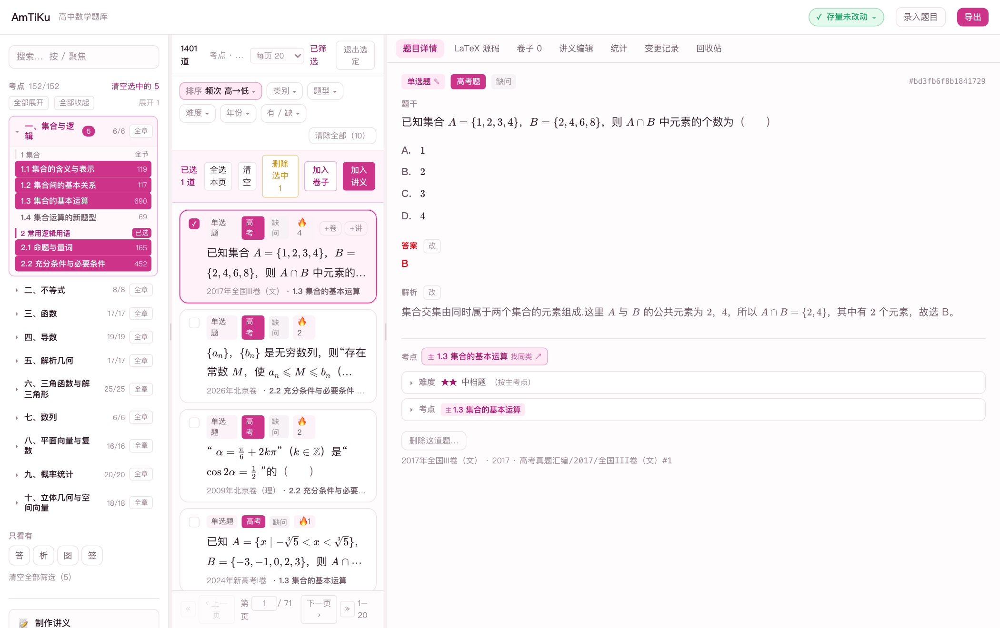
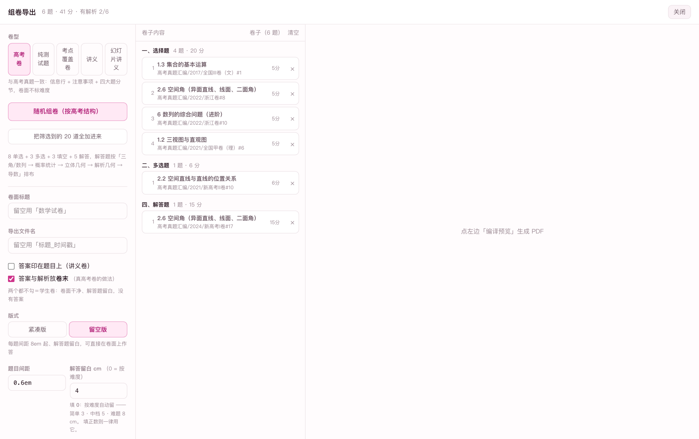

# 功能一览

> 截图全部来自本机真实运行（题库为作者私有数据，**不在本仓库中**；把题库放到
> `题目/`、`图片/`、`知识点.json` 即可复现同样的界面）。

## 1. 工作台：导航栏 + 筛选 + 宽列表

* **左栏**是**全局导航**，分两组：工作流（工作台 / 录题 / 知识点）和组卷输出（智能组卷 / 试卷管理 / 回收站 / 变更记录）。每项都挂一个单键
  快捷键（`W` `I` `K` `L` `V` `B` `P` `M` `R` `C`），右下角那颗浮球里能查到全部键位。
  底部是「当前范围」（全部 / 高考 / 模拟）。导航栏本身可以收成 60px 的图标条。
* **筛选面板**（可收起）：章 → 节 → 考点的完整课标树（152 个考点），带每个考点的题量与
  覆盖情况，点击即筛；下面是题型、难度、完整度（只看有 / 只看缺）、年份、排序，全部平铺，
  不用点开下拉菜单。
* **题目列表**（永远占满剩余宽度）：每张卡片给出**来源 / 考点 / 导出次数**、题型、类别、
  难度、齐全度，选择题还有**选项两列预览**；底部一行是**可以展开的答案与解析**——
  不用点进详情就能判断"这题能不能直接印"。顶部支持全文检索、每页条数、多选。
* **当前卷子**住在题目栏顶部那一条里：`已选 N 题 · 多少分 · 有解析几道`，
  点一下就在**同一栏里**切成卷子视图，再点「返回题目」切回来。
  **没有第三个栏目**——所以题目栏永远占满剩下的宽度。
* **卷子里怎么调顺序**：卷面是固定按 `单选 → 多选 → 填空 → 解答` 分节的
  （这是高考卷面的规矩），所以能调的只有**每个题型内部**的先后。
  每题右侧的 **▲ ▼** 就是干这个的：到顶/到底会置灰；**✕** 把它移出卷子。
  导出弹层（新建试卷 → 中间「卷子内容」）里是同一套按钮、同一份顺序。
* **题目详情**是**按需滑出的抽屉**：点卡片右上角那个按钮打开，Esc 关掉。里面有题干、
  选项、**红色标注的答案**、解析、考点、出处、原始 LaTeX 源码，也在这里改答案 / 改解析 /
  改考点。抽屉浮在内容区上，不看不占宽度。

* **⌘K 命令面板**（或点表头那颗 ⌘K）：导航、导出、切视图、清范围、开详情都在一个框里，
  支持 ↑↓ 选、回车执行、拼音搜；搜不到东西时回车直接把词丢给题库搜索。
* **可删的筛选胶囊**：表头把生效的筛选条件摆成带 × 的胶囊，点掉哪条就撤哪条。
* **列表密度**：表头右侧那个图标可以切「宽松 / 紧凑」，挑题时一屏多扫几道。
* **做错了能退**：往卷子里加、从卷子移出、清空卷子，都会给一条带**撤销**的提示。
  所以「清空卷子」不再需要点两下确认——确认框是每次都收的税，撤销只在真错时用。

> 记住你调好的布局：筛选面板收/开、导航栏收成 60px 图标条、详情抽屉拖多宽。
> 窗口窄的时候（<1180）首次打开会自动把筛选收起来，把宽度让给题目。

## 2. 章节与考点树

考点树是**课标结构**（十章 → 若干节 → 152 个考点），每题都挂到具体考点上，
所以能一眼看出"哪一章已经铺满、哪一节还空着"，也支持按考点直接组卷。
点章名或节名就**只看这一章 / 这一节**（不用一个一个考点去点）。

## 3. 筛选

类别（高考真题 / 模拟题）、题型、难度、年份、有缺项——可叠加使用；
筛选条件会带进组卷，比如"2020 年之后的导数压轴题，只要没做过模拟卷的"。
筛了几项在筛选面板标题旁有一个数字，点面板底部的「清除全部筛选」一次清干净。

## 4. 题目详情

题干、选项、答案、解析、考点、出处同屏；右侧可切换 **LaTeX 源码**（题目本身是 LaTeX，
所见即所存）。答案用红色标出，解析支持完整的 LaTeX 公式与插图。

## 5. 组卷导出

* **三种卷型**：高考卷 / 纯测试卷 / 考点覆盖卷
* **高考卷**按真卷结构排布（8 单选 + 3 多选 + 3 填空 + 5 解答，解答题按三角 / 数列 /
  概率统计 / 立体几何 / 解析几何 / 导数分布），也可以「随机组卷」一键生成
* **版式**：紧凑版（省纸）/ 留空版（学生直接作答，可调题目间距与解答留白）
* **答案**：印在题目上、放卷末、或不印（学生卷）
* 导出为 PDF 需要本机装有 LaTeX，见 [TeXLive安装.md](../TeXLive安装.md)

## 6. 录入题目

界面里可直接**粘贴 LaTeX 录入**：解析器先验证格式（15 项规范检查）、查重、预检缺图，
全部通过才允许入库；入库时会自动规范化（不规范的题根本进不来）。

---

* 想自己试：见 README 的「快速开始」。
* 遇到问题：见 [常见问题](常见问题.md)。
